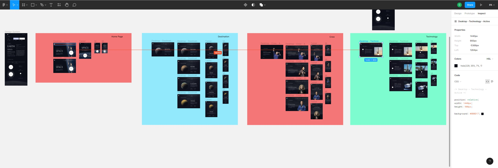

##### Space Tourism Website

*This is a solution to the [Space tourism website challenge on Frontend Mentor](https://www.frontendmentor.io/challenges/space-tourism-multipage-website-gRWj1URZ3).*

## Table of contents

- [Overview](#overview)
  - [The challenge](#the-challenge)
  - [Screenshot](#screenshot)
  - [Links](#links)
- [My process](#my-process)
  - [Built with](#built-with)
  - [Reflections](#what-i-learned)
  - [Continued development](#continued-development)
  - [Useful Resources](#useful-resources)

## Overview

### The challenge

Users should be able to:

- View the optimal layout for each of the website's pages depending on their device's screen size
- See hover states for all interactive elements on the page
- View each page and be able to toggle between the tabs to see new information

### Screenshot




### Links

- [View on CodeSandbox.io](https://codesandbox.io/s/space-tourism-tfw2y9)

## My process

### Built with

- [React](https://reactjs.org/) - JS library
- [Styled Components](https://styled-components.com/) - styling solution with theming
- [React Router v6](https://reactrouter.com/) - For routing/nav
- [Figma](https://www.figma.com/) - Provided design files

### Reflections

Through the course of this project, I got more comfortable working with styled-components and settled into patterns that fit my mental models on component-based styling. I also better compartamentalized imports/exports to avoid bloating component inventories (e.g. I found it to make more sense for me to contain all my typograpghic components in a single module.) Here is an example of a typographic component:

```js
const HeadingOne = styled.h1`
  font-family: ${({ theme }) => theme.fontFamily.primary};
  font-style: normal;
  font-weight: 400;
  font-size: 150px;
  line-height: 172px;
  color: ${({ theme }) => theme.colors.offWhite};
  text-transform: uppercase;
  text-align: ${({ centered }) => (centered ? "center" : "left")};

  @media (${({ theme }) => `max-width: ${theme.devices.tablet}`}) {
    text-align: center;
  }
  @media (${({ theme }) => `max-width: ${theme.devices.mobile}`}) {
    font-weight: 400;
    font-size: 80px;
    line-height: 100px;
  }
```

I experimented with alternatives to purely CSS responsive solutions. Here is a snippet of my Navigation component that conditionally rendered based on changes to window width:

```js
const GlobalNav = () => {
  const [width, setWindowWidth] = useState(0);

  const updateDimensions = () => {
    const width = window.innerWidth;
    setWindowWidth(width);
  };

  useEffect(() => {
    updateDimensions();
    window.addEventListener("resize", updateDimensions);
    return () => window.removeEventListener("resize", updateDimensions);
  }, []);

  return <>{width >= 588 ? <Nav /> : <MobileNav />}</>;
};
```

This pattern could probably be refactored as a custom, re-usable hook or as a Provider style component that wraps the App. I think for this specific example, I would have been better off working through a solution that was pure CSS.

Another pattern I found useful was dynamic object properties. I used this to set image sources upon chnages at the subnav layer. This type of site would probably see a performance boost by taking advantage of a server side rendering framework.

```js
// Background Images
import desktopBkg from "./crew/background-crew-desktop.jpg";
import tabletBkg from "./crew/background-crew-tablet.jpg";
import mobileBkg from "./crew/background-crew-mobile.jpg";
// crew Images
import ansariImg from "./crew/image-ansari.png";
import gloverImg from "./crew/image-glover.png";
import hurleyImg from "./crew/image-hurley.png";
import shuttleworthImg from "./crew/image-shuttleworth.png";

const crewImages = {
  desktopBkg,
  tabletBkg,
  mobileBkg,
  ansari: ansariImg,
  glover: gloverImg,
  hurley: hurleyImg,
  shuttleworth: shuttleworthImg,
};

// using in the actual component...
<FeaturedImage src={crewImages[featured.name]} />;
```

### Continued development

Working on this project underscored the need to spend a more extended amount of time with the design files. In this case, the design files did not make user flows explicit. If I were doing over again, I would add in the protyping myself to ensure that I have all the user flow pathways mapped out. More time in the design space would have better allowed me to see component patterns and recognize configureable sub-types instead of writing redudantly bespoke components (particularly layout containers).

### Useful resources

I always find Robin Wieruch's blog posts to be highly accessible and useful:

- [React Router 6 Tutorial](https://www.robinwieruch.de/react-router/)
- [React Styled Components Tutorial](https://www.robinwieruch.de/react-styled-components/)
